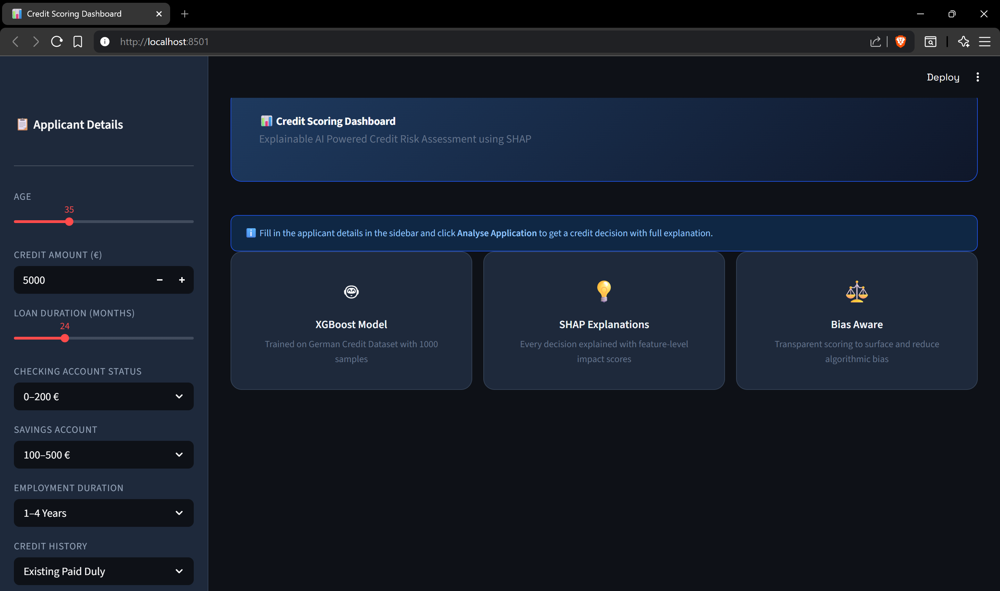
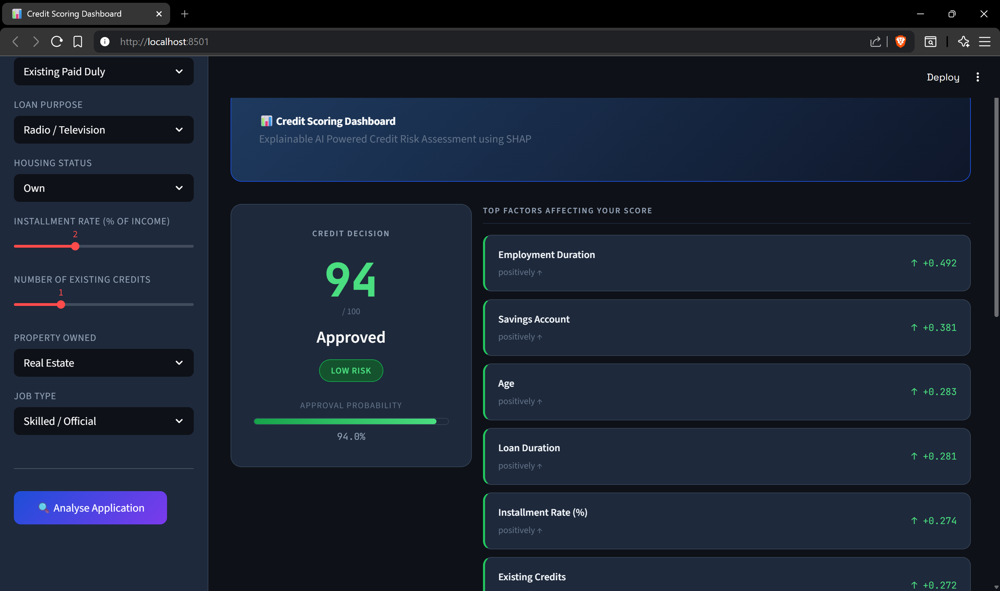
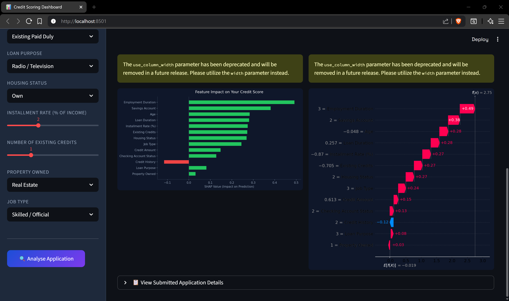
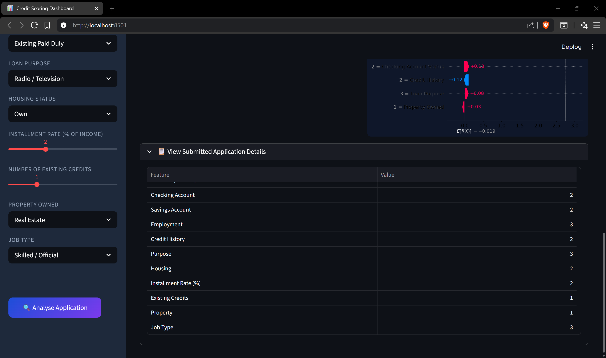

# Explainable Credit Scoring Dashboard

An AI Powered Credit Risk Assessment Dashboard that explains every decision using SHAP (SHapley Additive exPlanations). Built with XGBoost, SHAP and Streamlit.

---

## Quick Start

### 1. Clone & Install

```bash
git clone https://github.com/AmmarAli12369001/Credit-Scoring-Dashboard
cd Credit-Scoring-Dashboard
pip install -r requirements.txt
```

### 2. Download Dataset

Download the **German Credit Dataset** (statlog version) from UCI:

```
https://archive.ics.uci.edu/ml/machine-learning-databases/statlog/german/german.data
```

Save it to:
```
data/raw/german.data
```

### 3. Train the Model

```bash
python src/train.py
```

This will:
- Preprocess and Clean the dataset
- Apply SMOTE to handle Class Imbalance
- Train an XGBoost Classifier
- Save the Model to `models/xgboost_model.pkl`
- Save the Scaler to `models/scaler.pkl`

### 4. Launch the Dashboard

```bash
streamlit run app/app.py
```

Open your browser at: `http://localhost:8501`

---

## How It Works

1. **User Input**: Applicant Details are entered via Sidebar Form
2. **Preprocessing**: Inputs are Scaled using the saved Standard Scaler
3. **Prediction**: XGBoost Model outputs Approval Probability → Credit Score (0–100)
4. **Explanation**: SHAP TreeExplainer computes feature contributions
5. **Visualization**: Waterfall Chart + Bar Chart show exactly why the decision was made

---

## Model Performance

| Metric    | Score  |
|-----------|--------|
| Accuracy  | ~78%   |
| ROC-AUC   | ~0.83  |
| F1 (Good) | ~0.85  |
| F1 (Bad)  | ~0.62  |

---

## Ethical Considerations

- SHAP Explanations are checked for over reliance on **Age** (A potentially Sensitive Feature)
- Class imbalance is handled via **SMOTE** to prevent bias toward majority class
- The dashboard is designed for **Transparency**, users can see exactly what drove their Score

---

## Tech Stack

| Tool            | Purpose                    |
|-----------------|----------------------------|
| XGBoost         | Credit Risk Classification |
| SHAP            | Model Explainability       |
| Streamlit       | Web Dashboard              |
| scikit-learn    | Preprocessing, Metrics     |
| imbalanced-learn| SMOTE Oversampling         |
| Matplotlib      | SHAP Chart Rendering       |

---

## Dataset

**German Credit Dataset**: UCI Machine Learning Repository  
1000 Samples, 20 Features, Binary Classification (Good/Bad Credit Risk)  
Link: https://archive.ics.uci.edu/dataset/144/statlog+german+credit+data

## Screenshots

### 1.


### 2.


### 3.


### 4.

